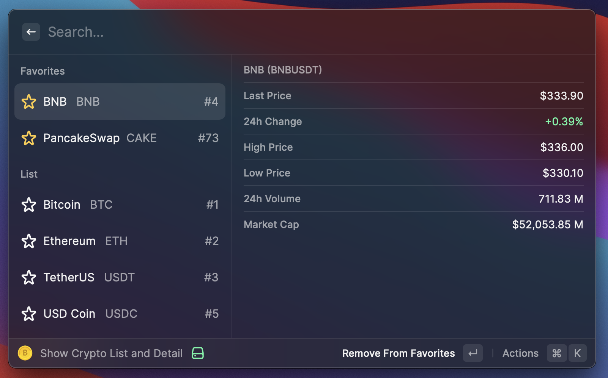

# Crypto List

This Raycast extension allows you to access data on 3000 cryptocurrencies and visit the corresponding coin pages on Binance's website.

## Installation
1. Clone this repository or download the latest release.
2. Open the Raycast app and navigate to the Extensions tab.
3. Click the + button in the lower left corner and select "Add Script Command".
4. Select the "bash" language and choose the downloaded "binance-data.sh" file.
5. Customize the command name and icon as desired.
